# 🧠 AI Hiring Assistant — Production-Ready AI SaaS

> AI-powered SaaS platform for resume parsing, semantic search, and job-candidate matching using RAG and vector embeddings.

---

## 🚀 Overview

**AI Hiring Assistant** is a full-stack AI SaaS built with FastAPI and Docker that enables:

- Resume PDF ingestion
- Embedding-based semantic search
- RAG-powered resume Q&A
- Job-candidate similarity matching
- Bulk resume processing
- JWT authentication system
- Admin analytics
- Automated API testing
- Dockerized deployment

This project demonstrates real-world AI engineering practices including production-ready API architecture, secure authentication, vector search using FAISS, embedding generation with SentenceTransformers, middleware performance logging, environment-based configuration, automated testing with pytest, and containerized deployment.

---

## 🏗️ System Architecture

```mermaid
flowchart TD
    A["🖥️ Client\n(Frontend / Swagger UI)"]
    B["⚡ FastAPI Backend"]
    C["🔐 Authentication Layer\n(JWT + bcrypt)"]
    D["📄 Resume Parser\n(PDF Extraction)"]
    E["🤖 Embedding Engine\n(SentenceTransformers)"]
    F["🗄️ FAISS Vector Store"]
    G["🎯 Matching & RAG Engine"]
    H["🗃️ Database\n(SQLAlchemy ORM)"]

    A -->|HTTP Request| B
    B --> C
    C -->|Authenticated| D
    D -->|Extracted Text| E
    E -->|Vectors| F
    F -->|Similarity Search| G
    G -->|Read / Write| H

    style A fill:#4F46E5,color:#fff,stroke:#3730A3
    style B fill:#0EA5E9,color:#fff,stroke:#0284C7
    style C fill:#F59E0B,color:#fff,stroke:#D97706
    style D fill:#10B981,color:#fff,stroke:#059669
    style E fill:#8B5CF6,color:#fff,stroke:#7C3AED
    style F fill:#EF4444,color:#fff,stroke:#DC2626
    style G fill:#EC4899,color:#fff,stroke:#DB2777
    style H fill:#6B7280,color:#fff,stroke:#4B5563
```



---

## 🛠️ Tech Stack

| Layer | Technology |
|-------|-----------|
| **Backend** | FastAPI, SQLAlchemy |
| **Authentication** | JWT (`python-jose`), bcrypt (`passlib`) |
| **AI / ML** | SentenceTransformers, FAISS |
| **Infrastructure** | Docker, Docker Compose |
| **Testing** | pytest, httpx |

---

## 🔥 Core Features

### 🔐 Authentication
- JWT-based login with secure password hashing
- Protected endpoints with role-aware access

### 📄 Resume Processing
- PDF upload & text extraction
- Automatic embedding generation and vector indexing via FAISS

### 💬 RAG Resume Q&A
- Ask natural-language questions about uploaded resumes
- Context-aware semantic retrieval for accurate answers

### 🎯 Job Matching Engine
- Embedding similarity scoring
- Ranked candidate results for any job description

### 📦 Bulk Resume Processing
- Multiple file ingestion in a single request
- Batch embedding pipeline for efficiency

### 📊 Admin Dashboard
- User statistics and resume tracking metrics

### 🧪 Testing
- Automated API testing with pytest
- Full route validation and authentication coverage

---

## ⚙️ Local Installation

**1. Create and activate a virtual environment**

```bash
python -m venv venv
# Windows
venv\Scripts\activate
# macOS / Linux
source venv/bin/activate
```

**2. Install dependencies**

```bash
pip install -r requirements.txt
```

**3. Run the API**

```bash
uvicorn api.main:app --reload
```

Visit the interactive docs at: [http://localhost:8000/docs](http://localhost:8000/docs)

---

## 🐳 Run with Docker

```bash
docker compose up --build
```

API available at: [http://localhost:8000/docs](http://localhost:8000/docs)

---

## 🧪 Run Tests

```bash
pytest
```

All authentication and core endpoints are covered.

---

## 🔐 Environment Variables

Create a `.env` file in the project root:

```env
SECRET_KEY=your_secret_key
ALLOWED_ORIGINS=http://localhost:3000
DATABASE_URL=sqlite:///./app.db
```

> ⚠️ **Never commit your real `.env` file to version control.**

---

## 📈 Future Improvements

- Role-based access control (RBAC)
- PostgreSQL production database
- CI/CD pipeline
- Kubernetes deployment
- Monitoring & logging stack (Prometheus + Grafana)
- Cloud deployment (AWS / GCP)

---

## 👨‍💻 Author
#
**Rushikesh Muneshwar**  
*AI Engineer | FastAPI | RAG Systems | Production ML*